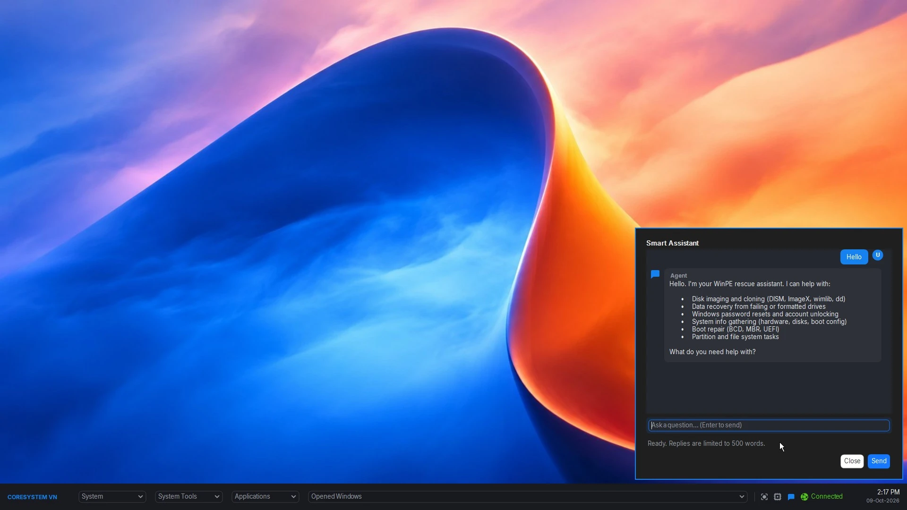
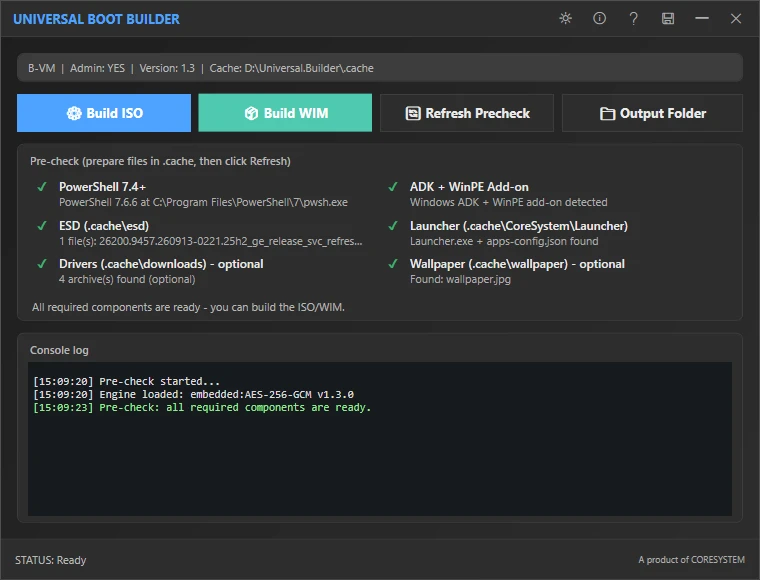

# WinPE Launcher



A lightweight, native **taskbar-style launcher** for **Windows PE (WinPE) amd64** and
**Windows x64**. It opens applications and scripts, exposes system tools (Wi-Fi,
BitLocker, clock sync), and adds a built-in **System Diagnostic**, a full-screen
**Screenshot** tool, and an optional **Smart Assistant** that chats with any
OpenAI-compatible LLM — all from a single ~4 MB executable.

> Part of the **Universal Builder** initiative by [CoreSystem](https://coresystem.vn).

---

## Highlights

- **Native C#** (WinForms / .NET Framework 4.5) — no installer, no services, no runtime download.
- **Single self-contained exe**, about **4 MB**, with a **RAM footprint under 30 MB**.
- **WinPE-ready**: the UI library (AntdUI) and fonts (Inter) are embedded — **no DLL files** beside the exe.
- **Config-driven**: one `apps-config.json` (comments and missing commas tolerated) drives apps, branding, timezone, LLM endpoint, and UI scale.
- **Offline-first**: only Smart Assistant and clock sync require the network.

---

## Features

| Area | Contents |
|---|---|
| **System** | Shutdown / Reboot (`wpeutil`), Wi-Fi, BitLocker unlock, Sync Time |
| **System Tools** | Command Prompt, Notepad, PowerShell, Task Manager, System Info |
| **Applications** | App/script list from `apps-config.json`; relative paths are resolved across fixed drives under `\CORESYSTEM\Softwares`, `\CORESYSTEM\Scripts`, `\CORESYSTEM` |
| **Opened Windows** | Lists running windows (excluding the shell itself); click to activate |
| **Smart Assistant** | Chat modal against any OpenAI-compatible LLM: Markdown rendering, selectable/copyable text, JSONL session history, ≤ 500-word replies, UTF-8 mojibake repair, clear errors when the endpoint/key is missing |
| **System Diagnostic** | Read-only overview via `Get-CimInstance`: System, CPU, RAM modules, storage health, volumes with BitLocker status, graphics, network, battery, and problem devices |
| **Screenshot** | One-click (or **PrintScreen**) full-screen capture, saved to `USB:\Screenshots\IMG-<timestamp>.jpg` |
| **Bar** | Whitebox title (≤ 15 chars), network status icon (Connected / Disconnected), two-line clock in a configurable timezone, chat / diagnostic / screenshot icons, adjustable UI scale |
| **Dialogs** | Wi-Fi, BitLocker, and toast notifications (themed, with an accent border) |

---

## Design goals

- **Runs on WinPE.** No dependency on Segoe UI (Inter is embedded), no external DLLs
  (AntdUI is embedded), and any file it writes goes to `%TEMP%` (a RAM disk) or the USB.
- **Small and native.** A single native executable of about **4 MB** and **under 30 MB
  of RAM** — small enough to ship inside boot media and to run comfortably in a minimal
  WinPE environment.
- **Single exe + one config file.** You ship only `Launcher.exe` and `apps-config.json`.
- **Hand-edit friendly config.** `apps-config.json` supports `//` comments and can omit
  commas (custom parser) because configs on WinPE are often edited by hand.
- **Modern, compact UI.** A fixed bottom bar (56 px, DPI-aware) with a clean dark theme.
- **No hardcoded secrets.** The LLM endpoint and keys are **BYOK** — the user supplies them.

---

## Repository layout

```
.
├── LICENSE                     MIT license
├── README.md                   this file (English)
├── README-VI.md                Vietnamese README
├── NOTES.md                    development log / technical notes
├── THIRD-PARTY-NOTICES.md      Inter (OFL-1.1), Hack (MIT), AntdUI (Apache-2.0)
├── Launcher.csproj             project file (win-x64, .NET Framework 4.5, C# 7.3)
├── build.cmd                   MSBuild wrapper
├── apps-config.json            sample configuration
├── src/                        C# source (Program, MainForm, Dialogs, Services, Engine, Fonts, Resources)
├── lib/                        AntdUI.dll (build-time reference; embedded into the exe)
├── ref/                        reference assets (screenshot.webp, builder.webp) + vendored .NET 4.5 reference assemblies
└── release/                    prebuilt Launcher.exe + apps-config.json
```

---

## Build

Requirements: **Windows** with **MSBuild** (Visual Studio 2017+ or Build Tools).

```cmd
build.cmd
:: is equivalent to: msbuild Launcher.csproj /t:Rebuild /p:Configuration=Release
:: output: bin\Release\Launcher.exe  and  bin\Release\apps-config.json
```

No .NET 4.5 Targeting Pack is required — the repo vendors the reference assemblies under
`ref/.NETFramework/v4.5/` and points `TargetFrameworkRootPath` at them.

Deploy by copying **`Launcher.exe` + `apps-config.json`** to any folder
(e.g. `D:\Softwares\Launcher\` on a USB, or into the boot image).

---

## Configuration (`apps-config.json`)

| Key | Meaning |
|---|---|
| `whitebox` | Title shown on the left of the bar (max 15 characters; longer is truncated with `…`) |
| `timezone` | Timezone applied at startup (e.g. `SE Asia Standard Time`) |
| `uiScale` | UI scale for the launcher and its dialogs (1 = 100%). FullHD is usually best at `1` or `1.25`; 2K/4K may need `1.5` or `2`. Leave empty to default to `1`. |
| `assistant` | LLM connection settings (BYOK) — see below |
| `apps[]` | Applications list: `name`, `path`, and optional `args`, `cwd`, `icon` |

### Applications

A **relative** `path` is resolved against every fixed drive (network/RAM drives are
skipped), trying in order:

1. `<drive>:\CORESYSTEM\Softwares\<path>`
2. `<drive>:\CORESYSTEM\Scripts\<path>`
3. `<drive>:\CORESYSTEM\<path>`

An absolute `path` is used as-is. Launch method depends on the extension:

- `.exe` → run directly (honours `args` and `cwd`)
- `.ps1` → `powershell.exe -NoProfile -ExecutionPolicy Bypass -File "<path>"`
- `.bat` / `.cmd` → `cmd.exe /c "<path>"`

### Smart Assistant — BYOK

```jsonc
"assistant": {
  "endpoint": "https://api.example.com/v1",  // OpenAI-compatible; "/chat/completions" is appended if missing
  "apiKey": "<YOUR-API-KEY>",                // sent as: Authorization: Bearer <key>
  "apiSecret": "",                           // optional -> header X-Api-Secret
  "model": "your-model-name",                // exact model name your endpoint accepts
  "headers": {}                              // optional -> extra request headers
}
```

Any OpenAI-compatible API works (OpenAI, vLLM, Ollama, custom gateways…). If the
endpoint/key is missing or invalid, the error is shown directly in the chat pane.

> The config is **plain text next to the exe** — anyone who can read the file can read
> the key. Never commit real keys; the repository copy keeps empty placeholders.

---

## Runtime environment

- Windows 10/11 x64, or WinPE amd64.
- **.NET Framework 4.5+** (x64). On WinPE, add the **.NET Framework** optional component
  (`WinPE-NetFx`) — WinPE ships without .NET by default.
- **Windows PowerShell 5.1** is used by the Smart Assistant engine and to run `.ps1` apps
  (add the matching WinPE PowerShell optional component).

---

## License & disclaimer

Released under the **MIT License** — see [`LICENSE`](LICENSE).

The software is provided **"as is", without warranty of any kind**, express or implied,
including but not limited to the warranties of merchantability, fitness for a particular
purpose, and non-infringement. **In no event shall the authors or copyright holders be
liable for any claim, damages, or other liability** arising from, out of, or in connection
with the software or its use. **You have full freedom to use, modify, and redistribute the
codebase at your own discretion and at your own risk**; all responsibility and liability
rest with you.

Third-party components are listed in
[`THIRD-PARTY-NOTICES.md`](THIRD-PARTY-NOTICES.md).

---

## Trademarks

**Microsoft**, **Windows**, **Windows PE / WinPE**, and other Microsoft product names are
trademarks of the Microsoft group of companies. This project is an **independent** work and
is **not affiliated with, authorized, sponsored, or endorsed by Microsoft Corporation**.
All other trademarks are the property of their respective owners.

---

## Please do not turn WinPE into a desktop

WinPE is a **preinstallation/rescue environment**, not a general-purpose operating system.
Using this launcher to build a full desktop experience on top of WinPE (persistent shell,
general daily use, etc.) is **not recommended** and may violate **Microsoft's licensing and
usage terms for the Windows Preinstallation Environment**. Use the launcher for its intended
purpose: temporary rescue, diagnostics, deployment, and recovery workflows.

---

## Partnership — MSP / ISV



This repository provides the **Launcher only**, as open source under MIT.

The **visual Universal Builder** (the GUI tool that assembles branded WinPE **ISO / WIM**
boot media with your own applications, scripts, and PowerShell modules) is available
through a **partnership program for MSPs and ISVs** — for example, to ship your own
recovery/support tooling inside a customized boot image.

To learn more, visit **[https://coresystem.vn](https://coresystem.vn)**.

---

See also: [`NOTES.md`](NOTES.md) for the detailed development log.
